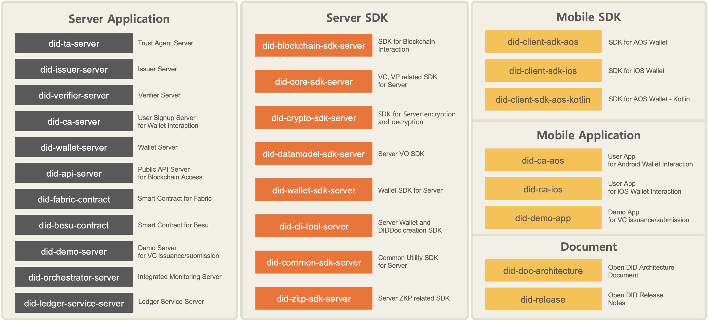

# OmniOne Open DID
The OmniOne Open DID Project aims to enhance the authenticity and reliability of digital identity verification by developing a standardized and interoperable framework. It seeks to build and manage a global ecosystem, form a collaborative network, and drive the growth of the DID industry through the dissemination of standard technologies. 

On this journey, OmniOne respects the power of the Open DID community and aims to integrate a global digital identity verification platform based on blockchain, ensuring easy and accessible benefits from public institutions, welfare, healthcare, education, and economic infrastructure for everyone. 

Furthermore, we will establish a Self-Sovereign Identity (SSI) system for marginalized communities worldwide and provide various benefits to diverse participants in the ecosystem. By doing so, we aim to reduce social costs and fulfill our social responsibility in creating a virtuous cycle within the identity ecosystem.

### Community Site
[OmniOne Open DID Community](https://opendid.omnione.net/community/)

### Discord - server invite link
[OmniOne Open DID Discord](https://discord.gg/vYJ3nv9ZK4)

### Document
[OmniOne Open DID Document](https://omnioneid.github.io/?locale=en&version=V1.0.0#/)

### Demo 
[OmniOne Open DID Demo-App](https://omnioneid.github.io/did-demo-app)  /  [OmniOne Open DID Demo-Server](https://github.com/OmniOneID/did-demo-server)

### Repositories

### Educational Videos
| Lecture | English | Korean | YouTube Link |
|---------|---------|--------|--------------|
| Lecture 1 | [Lecture 1] Introduction to DID Basics | [1강] DID 기본 개념 | [🎬 EN](https://www.youtube.com/watch?v=59FRLpMAS2w) / [🎬 KR](https://www.youtube.com/watch?v=98qFzeEC55Y) |
| Lecture 2 | [Lecture 2] Open DID Platform Components | [2강] Open DID 플랫폼 구성요소 | [🎬 EN]() / [🎬 KR]() |
| Lecture 3 | [Lecture 3] Trusted Environment in Open DID | [3강] Open DID 신뢰환경 | [🎬 EN]() / [🎬 KR]() |
| Lecture 4 | [Lecture 4] User Registration in Open DID | [4강] 사용자 등록 | [🎬 EN]() / [🎬 KR]() |
| Lecture 5 | [Lecture 5] VC Issuance in Open DID | [5강] VC 발급 | [🎬 EN]() / [🎬 KR]() |
| Lecture 6 | [Lecture 6] VP Submission in Open DID | [6강] VP 제출 | [🎬 EN]() / [🎬 KR]() |
| Appendix | [Appendix] Open DID GitHub Repository Structure | [부록] Open DID GitHub Repository 구성 및 소개 | [🎬 EN]() / [🎬 KR]() |
